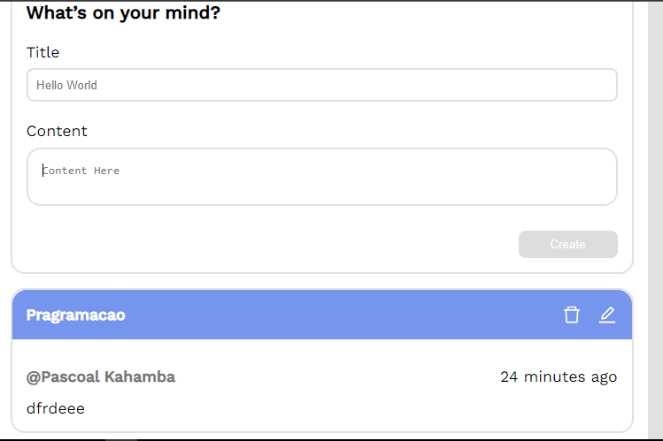
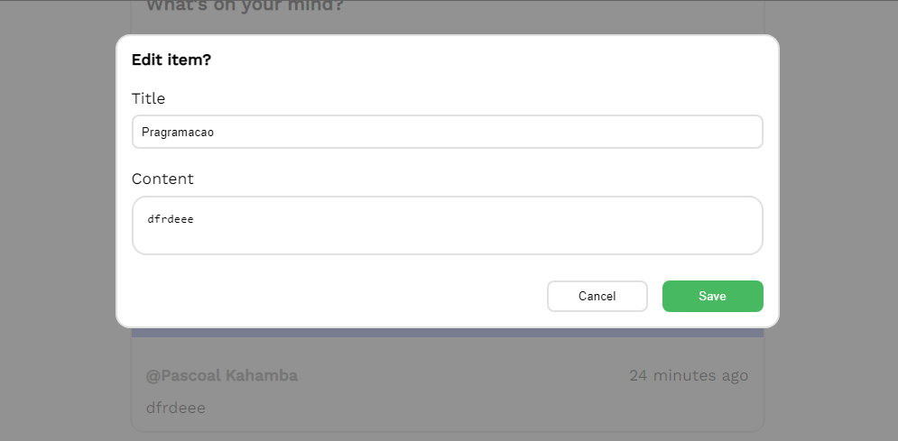

# Test CodeLeap

Este `Projeto` foi desenvolvido para uma `entrvista` da empresa `CodeLeap` com o objetivo de alcançar uma vaga como `Front-End React`. Básicamente o `projecto` tem a função de `adicionar` `editar` e `excluir` `itens` de lembrar que apenas o usuário `Pascoal Kahamba` é o `administrador` que pode fazer essas mudanças nas `lista de informações` é basicamente um `CRUD moderno` com `modal` para eliminar e editar uma `tarefa`, e claro com uma boa esperiência do usuário em navegar no site e campos estão perfeitamentes validados.

## Tecnologias

As seguintes ferramentas foram usadas na constuição deste projeto:

- HTML
- STYLED-COMPONENTS
- TYPESCRIPT
- REACT

#

Feito por ❤ Pascoal Kahamba meu [Linkedin](https://www.linkedin.com/in/pascoal-kahamba-7b43bb233?lipi=urn%3Ali%3Apage%3Ad_flagship3_profile_view_base_contact_details%3BTg8LEKayToyytOX1pVAQ%2Bg%3D%3D)

[👉Clique aqui para rodar o projeto👈](https://project-engineering-test.vercel.app/)😎
